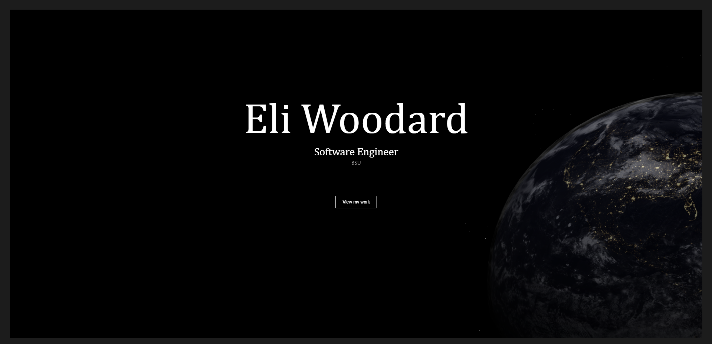

# Eli Woodard's Portfolio Website

## Overview

This repository contains the code for my portfolio website. As a Computer Science major and an aspiring Software Engineer, I've created this website to showcase my projects, skills, and experiences.

## Running locally
1. Download the repo onto your system.
2. Install Node.js v20.10.0
3. Change directory to the project.
4. Run `node .\server.js` 

## Technologies Used

- HTML
- CSS
- JavaScript
- SASS
- Three.js
- particles.js

## Contact

- Eli Woodard: [Github](https://github.com/EliWoodard)

For any additional questions or comments, please contact me through GitHub.
